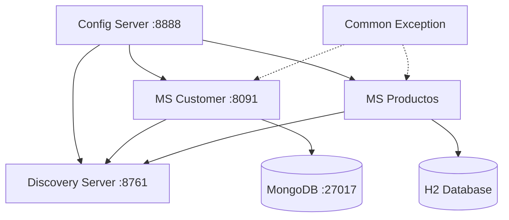

# Ecosistema de Microservicios con Spring Boot y Cloud

Este proyecto representa una arquitectura de microservicios robusta y profesional desarrollada con Java 17 y el ecosistema de Spring Boot 4.0.3 y Spring Cloud 2025.1.0. Incluye servicios de configuración centralizada, descubrimiento de servicios, manejo global de excepciones y persistencia de datos distribuida.

## 🏗️ Arquitectura del Sistema

El sistema sigue un patrón de arquitectura distribuida donde los componentes interactúan de la siguiente manera:



## 🛠️ Tecnologías Utilizadas

*   **Lenguaje:** Java 17
*   **Framework Principal:** Spring Boot 4.0.3
*   **Cloud Stack:** Spring Cloud 2025.1.0
*   **Persistencia de Datos:**
    *   **MongoDB:** Utilizado en `ms-customer` para almacenamiento NoSQL.
    *   **H2 Database:** Utilizado en `ms-productos` como base de datos en memoria para desarrollo.
    *   **Spring Data JPA / MongoDB:** Para la capa de acceso a datos.
*   **Registro y Descubrimiento:** Netflix Eureka.
*   **Configuración:** Spring Cloud Config (Perfil nativo para gestión de archivos YAML locales).
*   **Documentación API:** SpringDoc OpenAPI (Swagger UI integrado).
*   **Manejo de Errores:** Implementación de `ProblemDetail` (RFC 7807) a través de una librería compartida.
*   **Herramientas:** Lombok, Maven Wrapper, Docker Compose.

## 📦 Detalle de los Microservicios

| Servicio | Puerto | Descripción |
| :--- | :--- | :--- |
| `config-server` | 8888 | Provee configuraciones centralizadas a todos los servicios desde un repositorio nativo. |
| `discovery-server` | 8761 | Punto central de registro que permite que los microservicios se localicen entre sí. |
| `ms-customer` | 8091 | Gestiona el dominio de clientes. Implementa operaciones CRUD y validación de datos. |
| `ms-productos` | N/D | Servicio base para la gestión de productos con integración JPA. |
| `common-exception` | N/A | Proyecto Maven (JAR) que centraliza el `GlobalExceptionHandler` y la lógica de validación. |

## 🚀 Instalación y Despliegue

### Prerrequisitos
*   **JDK 17** instalado correctamente.
*   **Maven 3.8+** (aunque se incluyen wrappers `./mvnw`).
*   **Docker Desktop** o Docker Engine con Docker Compose.

### Pasos para la ejecución

1.  **Levantar Infraestructura Base:**
    Ejecute el contenedor de MongoDB necesario para el servicio de clientes:
    ```bash
    docker-compose up -d
    ```

2.  **Instalar la Librería Común:**
    Dado que `ms-customer` depende de `common-exception`, es necesario instalarla en el repositorio local de Maven:
    ```bash
    cd common-exception
    mvn clean install
    cd ..
    ```

3.  **Iniciar Servicios de Infraestructura:**
    *   **Servidor de Configuración:**
        ```bash
        cd config-server && ./mvnw spring-boot:run
        ```
    *   **Servidor de Descubrimiento:**
        ```bash
        cd discovery-server && ./mvnw spring-boot:run
        ```

4.  **Iniciar Microservicios de Negocio:**
    *   **Servicio de Clientes:**
        ```bash
        cd ms-customer && ./mvnw spring-boot:run
        ```

## 📖 Documentación de la API (ms-customer)

El servicio `ms-customer` expone una API REST profesional con los siguientes endpoints:

*   `POST /api/v1/customers`: Registra un nuevo cliente (Valida campos obligatorios y formato de email).
*   `GET /api/v1/customers`: Retorna la lista completa de clientes registrados.
*   `GET /api/v1/customers/{id}`: Obtiene la información detallada de un cliente específico.
*   `PUT /api/v1/customers/{id}`: Actualiza los datos de un cliente existente.
*   `DELETE /api/v1/customers/{id}`: Elimina un cliente del sistema.

**Swagger UI:** Puede visualizar y probar la API en tiempo real accediendo a `http://localhost:8091/swagger-ui/index.html` una vez que el servicio esté corriendo.

## 📁 Estructura del Repositorio

```text
.
├── common-exception/   # Manejo global de excepciones y validaciones
├── config-server/      # Configuración centralizada (Native Repo)
├── discovery-server/   # Registro de servicios Eureka
├── ms-customer/        # Lógica de negocio de Clientes y MongoDB
├── ms-productos/       # Lógica de negocio de Productos y JPA/H2
├── docker-compose.yml  # Orquestación de contenedores (DBs)
└── README.md           # Documentación principal
```

---
*Este proyecto ha sido estructurado siguiendo las mejores prácticas de desarrollo y arquitectura de software.*
